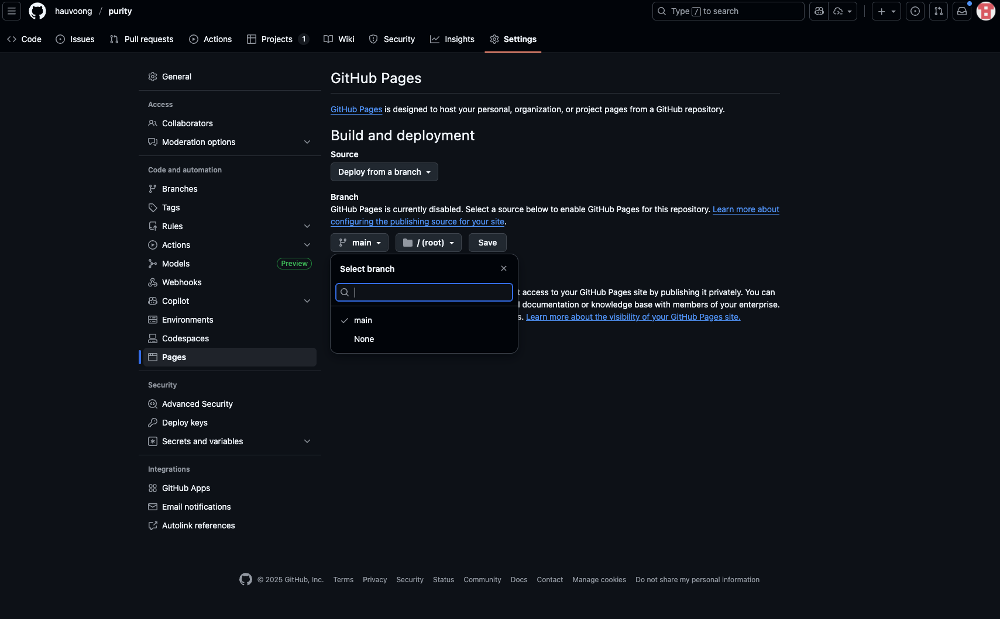
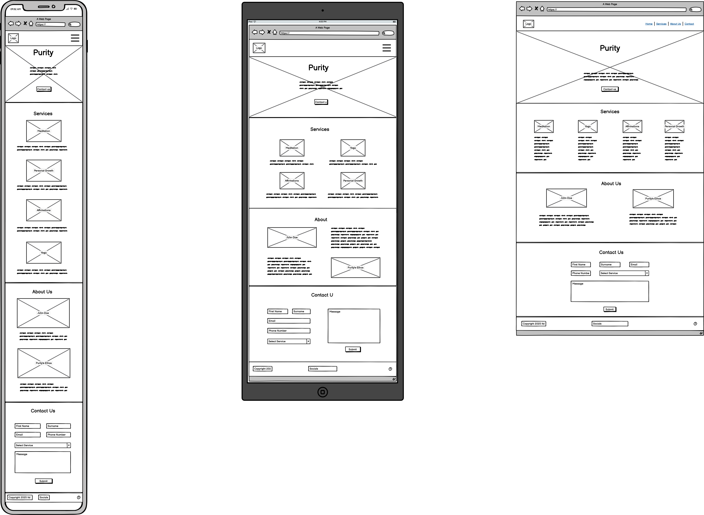

# Purity
**Project Overview**

Purity is a responsive, one-page wellness site, designed to help and support people on their mental health journey. 

**User Value**

## Tech / libraries

- HTML (static)
- CSS
- Bootstrap 5 (via CDN)
- Font Awesome (via CDN)

## Files

- `index.html` — Main HTML file. Includes Bootstrap and Font Awesome links.

## GitHub Pages — publish a live site
To publish your site with GitHub Pages:

1. Push your repository to GitHub.
2. Go to your repository's **Settings** > **Pages**.
3. Select the branch (e.g., `main`) and the root (`/`) folder, then save.

Your site will be live at `https://hauvoong.github.io/purity/` after a few minutes.

## Wireframes

