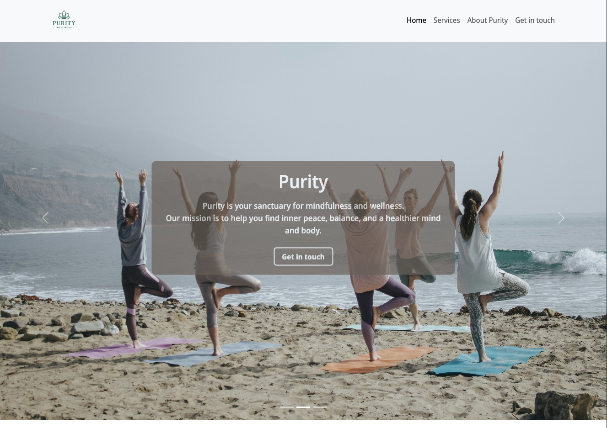
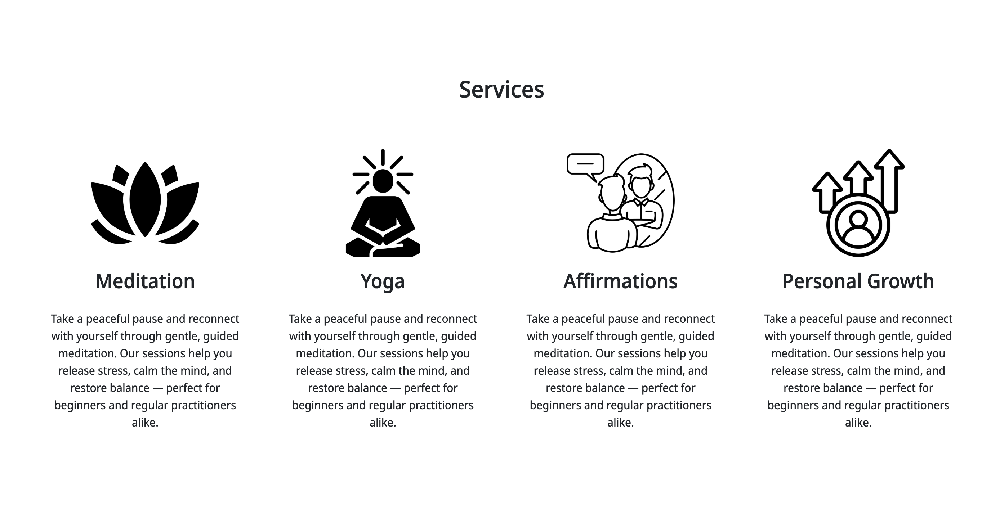
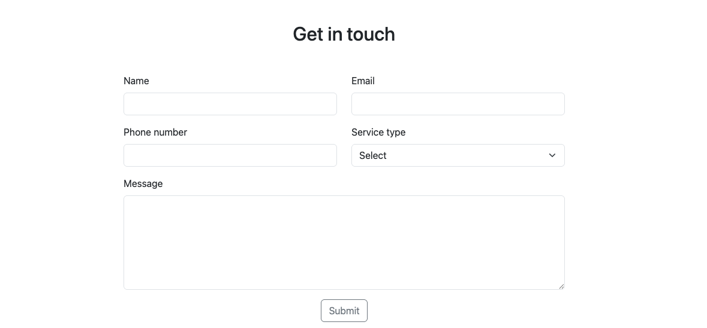
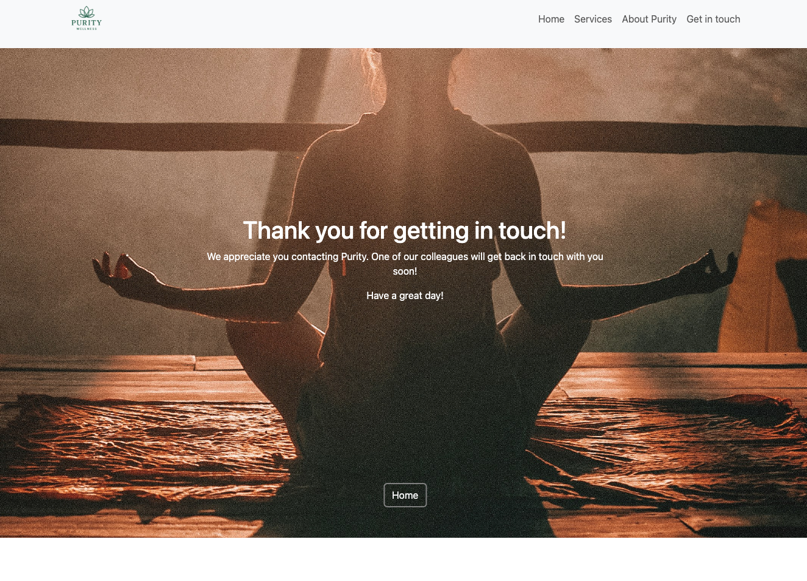
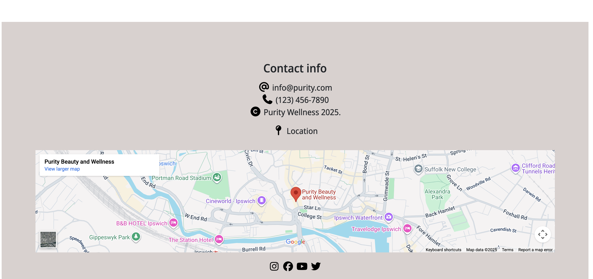
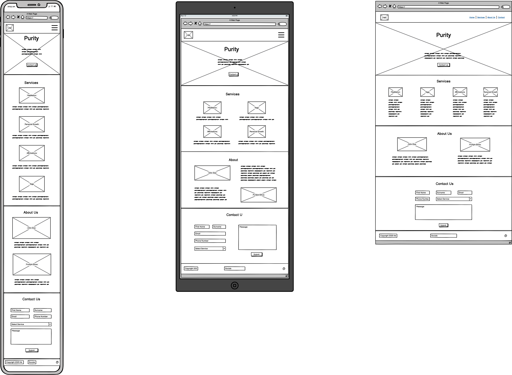
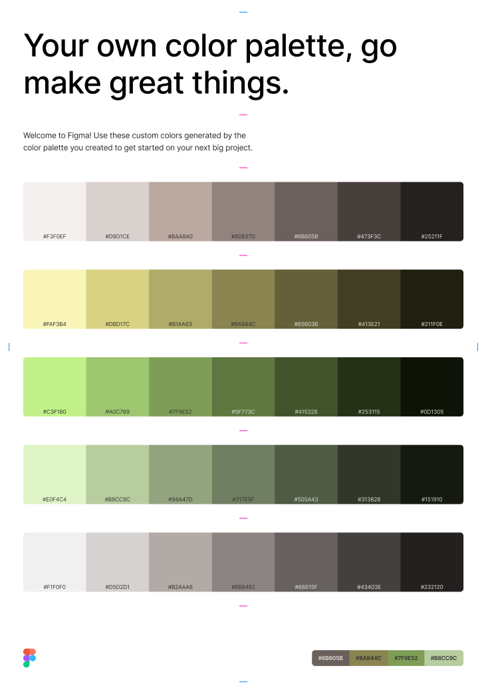

# Purity
**Project Overview**

Purity is a responsive, one-page wellness site, designed to help and support people on their mental health journey. It is a simple and clear layout allowing users to access self-help content to improve their mental health.
The layout is designed to be spacious, with warm and vibrant tones. 

Purity contains five main elements:

-   Home - A large hero image within a carousel, showcasing a gallery for users to get a feel for Purity's vibe. 

- Services - Allows users to see what services Purity has to offer.

- About Purity - Gives users a chance to get to know the founder and what Purity stands for

- Get in touch - A form for users to reach out and enquire about services and more. 

## Features ##
Navbar

Homepage

Services

About Purity

Get in touch

Success message

Footer

Additional Features

Fully responsive layout – Works smoothly on desktops, tablets, and smartphones.
Site is designed to be spacious and calming. You can get in touch via built in form/success page. Iframe added to show a google maps location. Built in padding-top so when a jump link is used, it includes the header of the section.

## User Story/testing ##
- Project Board: 
https://github.com/users/hauvoong/projects/6

## Wireframes ##
Visual design from user stories.

## Colour palette ##

Colour theme based on below pallette.

## Testing ##
Manual testing on the site to ensure all links are working. 

## Validation ##

## Debugging ##

Navigation:
- Navbar is overlapping hero image

- Hero image on small devices was not aligned to navbar. Solution: About Img was max-width was too large. Changed max-width from 500 too 400px. 

- Adding button, title and description to hero carousel, the div would be very cramp on small screens. Solution was to hide text but not the button. 

## Tech / libraries

- HTML 
- CSS 
- Bootstrap 5 (via CDN)
- Font Awesome (via CDN)
- Googlefonts (via CDN)

## Files ##

- `index.html` — Main HTML file. Includes Bootstrap and Font Awesome links.

## GitHub Pages — publish a live site ##
To publish your site with GitHub Pages:

1. Push your repository to GitHub.
2. Go to your repository's **Settings** > **Pages**.
3. Select the branch (e.g., `main`) and the root (`/`) folder, then save.

Your site will be live at `https://hauvoong.github.io/purity/` after a few minutes.

## Credits ##