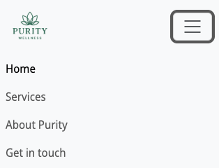

# Purity
**Project Overview**

Purity is a responsive, one-page wellness site, designed to help and support people on their mental health journey. It is a simple and clear layout allowing users to access self-help content to improve their mental health.
The layout is designed to be spacious, with warm and vibrant tones. The current layout is the MVP - focus was creating a good foundation to build from. 

Purity contains five main elements:

-   Home - A large hero image within a carousel, showcasing a gallery for users to get a feel for Purity's vibe. 

- Services - Allows users to see what services Purity has to offer.

- About Purity - Gives users a chance to get to know the founder and what Purity stands for

- Get in touch - A form for users to reach out and enquire about services and more. 

## Features ##
Navbar

Homepage

Services

About Purity

Get in touch

Success message

Footer

Additional Features

Fully responsive layout – Works smoothly on desktops, tablets, and smartphones.
Site is designed to be spacious and calming. You can get in touch via built in form/success page. Iframe added to show a google maps location. Built in padding-top so when a jump link is used, it includes the header of the section.
Accesibility has been built into the site via alt and aria attributes.

## User Story/testing ##
- Project Board: 
https://github.com/users/hauvoong/projects/6

## Wireframes ##
Visual design from user stories.

## Colour palette ##

Colour theme based on below pallette.

## Testing ##
Manual testing on the site to ensure all links are working. 

## Validation ##
index.html

success.html

styles.css

Lighthouse performance: 
Poor scores across performance and best practice. 

Solutions:
    - Remove Google Maps iframe link. Resulted in 100% best practice and 74% on performance. This can be a future feature. 
    - Compress images and upload
    - 

Resulted in a increase across the board. The final bug would be to change the caching which appears to be the major factor in the lower performance. Ran out of time to figure out solution.

## Debugging ##

Navigation:
- Navbar is overlapping hero image
Solution: I referenced the code from LMS module. 

- Hero image on small devices was not aligned to navbar. 
Solution: About Img was max-width was too large. Changed max-width from 500 too 400px. 

- Adding button, title and description to hero carousel, the div would be very cramp on small screens. 
Solution: After googling the issues, I learnt about d-block and the use to hide content. 

- Burger menu not collapsing after click when on the same page.
Solution: After referencing LMS, the solution was introduced but as a JS script, which I added. 

## Tech / libraries

- HTML 
- CSS 
- Bootstrap 5 (via CDN)
- Font Awesome (via CDN)
- Googlefonts (via CDN)

## Co-Pilot ##

AI use:
- Boilerplates (html and readme)
- Co-pilot making suggestions on my text.
- Completing repeating code changes.
- Asking co-pilot what a line of code meant

- The only case I used co-pilot for code was to add text and button as an overlay on top of the hero carousel.
Which I tried to understand as new code we havent been taught yet. 

## Files ##

- `index.html` — Main HTML file. Includes Bootstrap, CSS and Font Awesome links.
- `success.html` - Success page after sending message. Includes Bootstrap and CSS.

## GitHub Pages — publish a live site ##
To publish your site with GitHub Pages:

1. Push your repository to GitHub.
2. Go to your repository's **Settings** > **Pages**.
3. Select the branch (e.g., `main`) and the root (`/`) folder, then save.

Your site will be live at `https://hauvoong.github.io/purity/` after a few minutes.

## Credits ##

- LMS modules
    - Boardwalk Games
    - Love Running
    - Various content

- xAlex-an:
https://github.com/xAlex-an/mental-health-awareness

- Rebekah-codes:
https://github.com/Rebekah-codes/The-Inner-Compass-Project

Both developers work was very useful. Inspiration of site vision, layout, functionality readme structure. 

- Images sourced via: `https://unsplash.com/`

